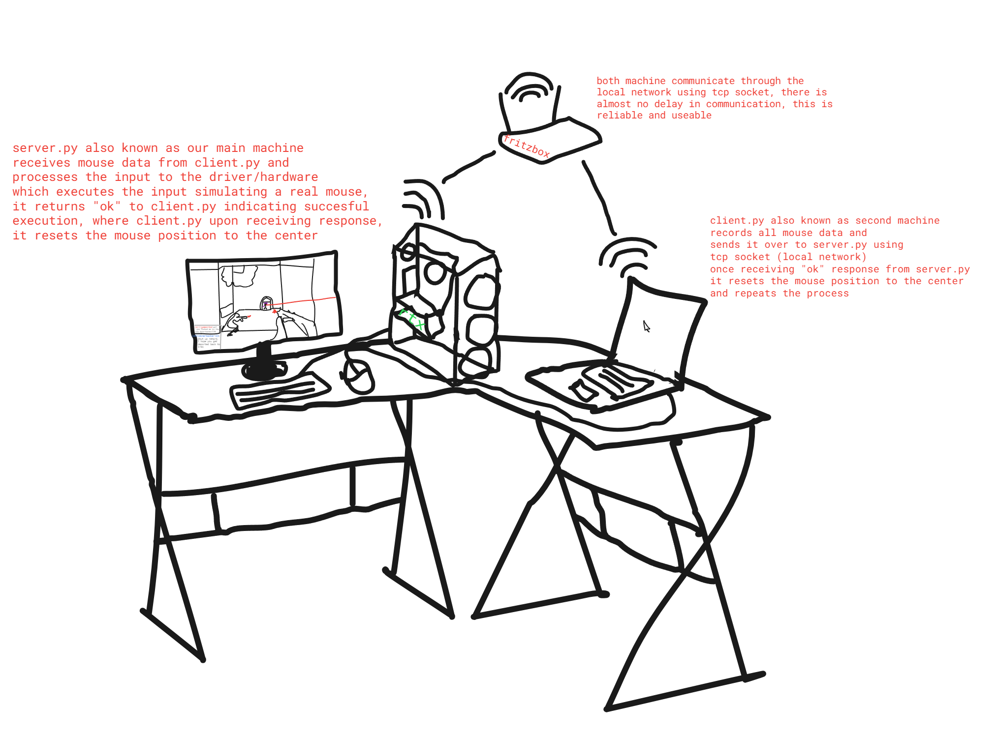

# Valorant Cheat: Bypass 2 Mouse Input Block

## Introduction
When I first got into cheeting, especially in Valorant, I was looking around the forum for ideas. That's when I stumbled upon [Bypass 2 Mouse Input Block](https://www.unknowncheats.me/forum/valorant/504673-bypass-2-mouse-inputs-2-pcs-wifi.html). The concept excited me, but I lacked a second PC at the time to properly test it. Despite the setback, I gave it a try, but unsurprisingly, nothing substantial came out of it.

A few days ago, the idea came to my mind again. Having moved countries and a new setup along with a second machine, I decided to give it another shot. I remade the concept in Python, connected my signed driver to it, and after a few hours, the hamster was running. Since I had no practical use for this and felt that the original thread lacked sufficient explanation, I decided to release my work here. Along with it, I'm including a proof of concept video and a drawing. The `server.py` also includes a simple aimbot for demonstration purposes.

**Important:** I will **NOT** include the driver I used as I need it for other projects. However, realistically, anything can be added to this – Arduino, KMBox, Raspberry Pi, any driver (e.g., GHub, Chinese drivers). The worry of a second input block is eliminated, though your driver might be detected.

## How It Works
`client.py` (on the second PC) records all mouse inputs and sends them over to `server.py` (on the main PC) using WiFi. Setting it up takes less than a minute, although this public release lacks the actual mouse movement.

**Requirements:**
- Gaming PC
- Spare PC (laptop, anything will do)
- Maybe a wireless mouse (not mandatory)

**Setup:**
- Ensure Python is installed on both machines along with the required modules.
- On the main PC, open cmd -> `ipconfig` -> copy IPv4 -> insert IPv4 into config.
- Choose any unoccupied port (I used 25565 because im a kid :) ) and add it to the config.
- Run `server.py` on the main PC, copy files to the spare PC, and run `client.py` (make sure you use same config). In this public version, it will just print the received data.

The drawing includes a little Easter egg (which might annoy someone), also have fun guessing what map I drew! :)

[Proof of Concept Video](https://streamable.com/2miw0d)

## Additional Notes
- This concept is and will stay undetected. Combined with some editing, they can't do anything about it.
- It can be combined with screen share software or an Ethernet shield to be even more overkill.
- The code is limited in handling fast movements, attributed to threading/cursor reset issues.
- Mouse movement is relative. Remove any physical mouse from the main PC if using this setup.

Feel free to contact me through my socials if you need help. In the video, I used my laptop as my PC hardware is banned for some reason. Just in case it's not visible, I used both aimlock + mouse in the video. 
I've added comments throughout the code to explain things further.
I shouldn't need to say this, but if you actually sell this, then only god and a lot of prayers can help you.

**- If this helped you or you like my work, feel free to check out my other projects. I also appreciate it if you star the repo and follow me on github, for more nice work :)**

[UnknownCheats Thread]([https://www.unknowncheats.me/forum/downloads.php?do=file&id=44890](https://www.unknowncheats.me/forum/valorant/635782-ud-bypass-vanguard-using-2pc-wifi-hardware.html))

## Educational Purpose
For educational & demonstration purposes only. Not for illegal activities or violating terms of service. The Author does not condone misuse. The author also doesnt condone invasive/intrusive kernel AC systems like vanguard though :)
